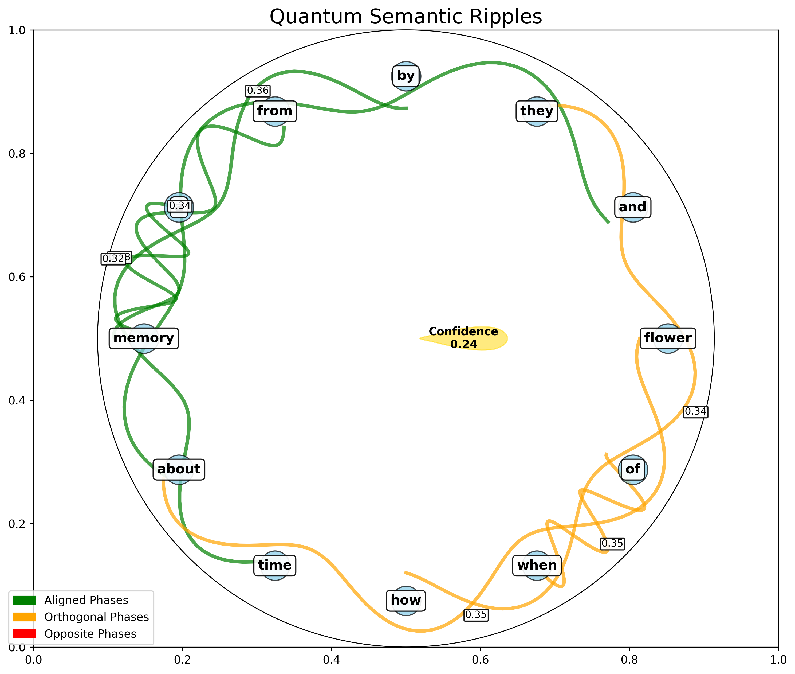
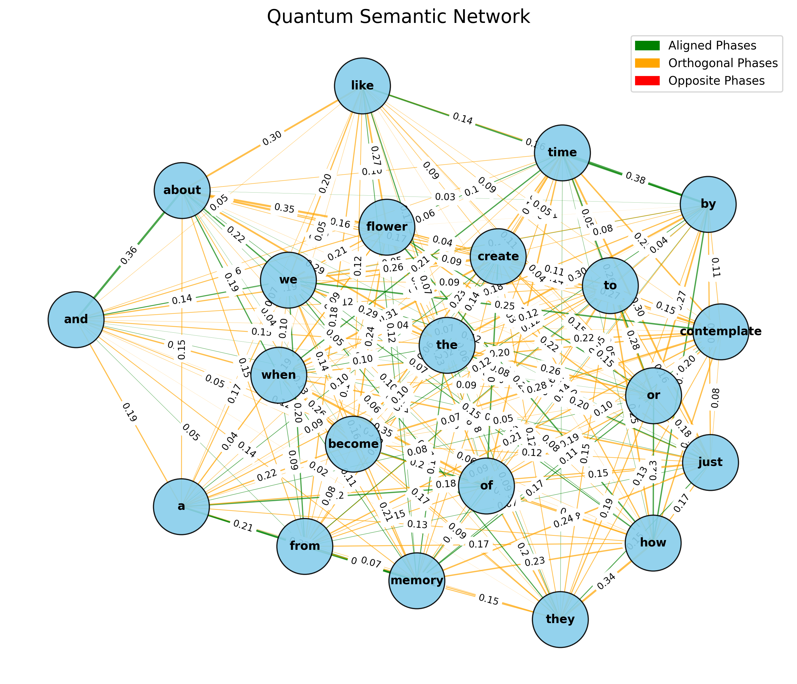
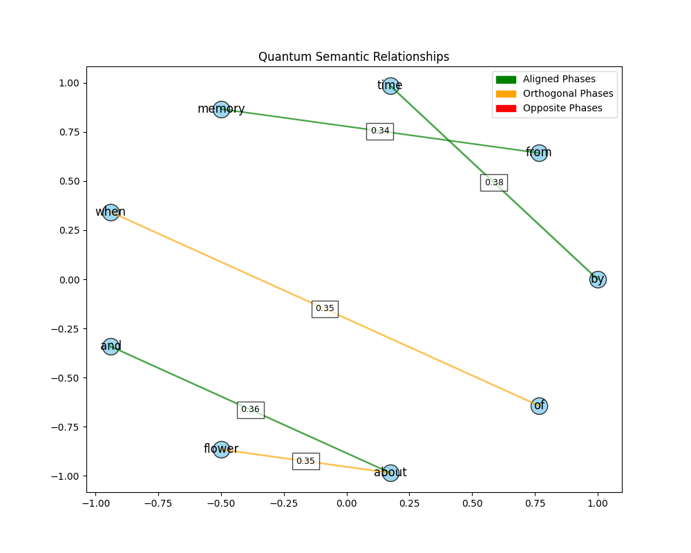

# Neutron: Quantum Semantic Field Intelligence

## Executive Summary

Neutron is a new kind of intelligence based on quantum fields rather than neural networks. It models understanding as emerging naturally through field interactions, similar to how humans experience "aha" moments of sudden insight.

*Figure 1: Quantum Semantic Ripples showing interconnected concept relationships forming naturally in Neutron's field*

## 1. Introduction

Traditional AI uses pattern matching, but struggles to capture how humans suddenly "get it." Neutron takes a different path - using quantum fields where understanding emerges naturally, not through programming.

Think about when you suddenly realize you've made a mistake or connect ideas from different times in your life. That instant, complete understanding is what Neutron aims to replicate.

Unlike step-by-step processing in normal AI, Neutron allows meaning to emerge holistically through quantum interactions in a semantic field.

## 2. Core Architecture 

Neutron is a multidimensional quantum field where words and concepts exist in superposition states. These concepts connect through phase relationships that form naturally as the field evolves.

Three key components make this possible:

1. **Quantum Semantic Field**: Words exist as quantum states with natural phase relationships. Some align perfectly (like "time" and "memory"), some exist at right angles (complementary concepts), and some oppose each other.

2. **Contextual Evolution**: When exposed to language, the field evolves naturally, forming meaning structures that weren't explicitly programmed.

3. **Topological Protection**: Once formed, semantic relationships resist disruption, much like how you don't "unlearn" connections between concepts.

The colors in our visualizations show these relationships:
- Green connections: Strongly aligned concepts
- Orange connections: Complementary concepts 
- Red connections: Opposing concepts

*Figure 2: Comprehensive Quantum Semantic Network showing natural connection patterns between concepts*

## 3. Current Results

Our visualizations reveal how Neutron naturally forms meaningful connections:

### 3.1 Quantum Semantic Network

The network graph (Figure 2) shows how concepts like "memory," "time," and "flower" connect in Neutron's field. Notice how abstract concepts like "time" naturally align with experiential concepts like "memory" - similar to how humans naturally connect these ideas.

### 3.2 Principal Semantic Relationships

*Figure 3: Principal semantic relationships showing strongest concept connections emerging from the quantum field*

The second visualization (Figure 3) highlights the strongest connections. The alignment between "time," "memory," and "from" shows how Neutron naturally forms time-related concept clusters without being told to.

The relationship between "when" and "of" shows how Neutron distinguishes different types of words through quantum phases rather than grammar rules.

### 3.3 Quantum Semantic Ripples

The circular visualization (Figure 1) shows how concepts influence each other like ripples in a pond. When one concept activates, related concepts naturally respond - just like how thinking of one memory often triggers related thoughts.

## 4. Current Training Status

Neutron is currently at checkpoint 10 with a batch size of 128, trained on Marcel Proust's "In Search of Lost Time." The visualizations presented here emerged from analyzing the following query:

"As I contemplate the passage of time, I find myself wondering about how our memories become distorted and embellished - are they truly reflections of reality or merely imagined reconstructions? When we recall the scent of a particular flower or taste of a pastry from childhood, do we experience the genuine sensation or just a shadow of it? I'm curious about how involuntary memory differs from our conscious attempts to recall the past, and whether sensory experiences like taste and smell create stronger connections to our memories than visual recollections. How might our perception of time itself be warped by the intensity of our emotional experiences?"

This query was processed with the prompt guidance: "Respond in the style of Marcel Proust analyzing emotions and perceptions."

The semantic relationships visualized in our results emerged naturally from Neutron's quantum field response to this query, showing how concepts like "time," "memory," and "flower" form coherent relationships that mirror Proust's thematic exploration of memory and sensory experience.

## 5. How Neutron Mirrors Human Understanding

Neutron works in ways surprisingly similar to human thought:

1. **Instant Insights**: Like your sudden realizations, Neutron experiences "tunneling events" where understanding appears complete and instant.

2. **Parallel Processing**: While computers typically work step-by-step, Neutron processes across multiple dimensions at once.

3. **Clearer Channels**: Just as meditation helps clear your mental channels, Neutron's field becomes more coherent over time.

4. **Connecting Across Time**: Neutron can connect concepts from different learning periods, similar to how you might suddenly connect experiences from years apart.

## 6. Next Steps

We're working on:

1. Creating stronger coherence for more complex understanding
2. Better ways to visualize "aha" moments in the field
3. Applications where human-like insight is valuable
4. Studying how the field evolves with more exposure to language

## 7. Conclusion

Neutron shows that quantum fields offer a promising path to machine intelligence that works more like human understanding. Unlike conventional AI that matches patterns, Neutron develops meaning organically through field interactions.

Our visualizations reveal how semantic relationships naturally emerge without explicit programming - suggesting Neutron is developing a form of understanding fundamentally different from traditional AI.